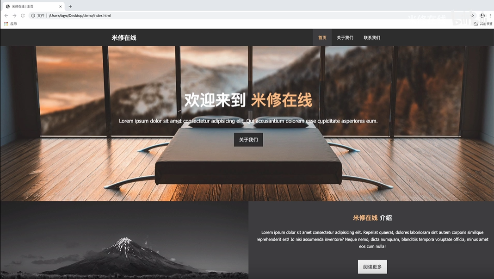
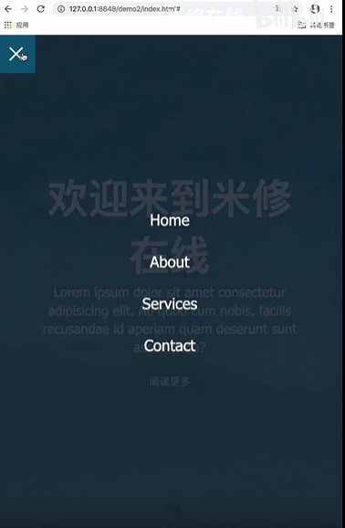
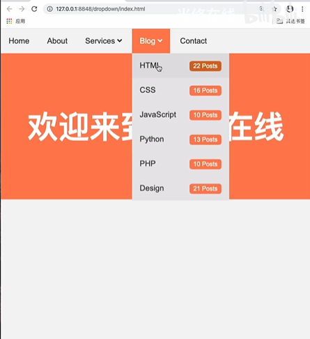

主要视频选用[后盾人教程](https://space.bilibili.com/282190994?from=search&seid=12608786908385243672)、[米修在线](https://space.bilibili.com/389008815?spm_id_from=333.788.b_765f7570696e666f.2)

视频并不需要全部看完

建议能跳过就跳过

快速刷视频、做实验

### 1.开发工具

​	建议选用vscode

​	可以安装些插件辅助 特别是保存刷新插件视频中会说明

[(后盾人)VSCODE的正确开启方式，程序员提速必学](https://www.bilibili.com/video/BV1V4411g7SR)

### 2.HTML标签

​	页面结构标签

​	语义标签

​	图像连接技巧

​	表单与列表

​	多媒体与表格

[(后盾人)html](https://space.bilibili.com/282190994/channel/detail?cid=95161)

[米修前端基础 p1-p17](https://www.bilibili.com/video/BV1nJ411R7Db)

### 3.css

​	基本语法

​	盒模型的高级用法

​	常用布局模型

​	css3 弹性盒模型、transition、animation、Grid布局的使用

[(后盾人)css](https://space.bilibili.com/282190994/channel/detail?cid=95160)

[米修前端基础 p17-p31](https://www.bilibili.com/video/BV1nJ411R7Db)

### 4.尝试html+css静态页面实战

关于图片素材可以使用其他图片代替，或者在评论中获取

[实战项目1 静态页面](https://www.bilibili.com/video/BV1oJ411j7M1)

[实战项目2 动画+过渡+变换菜单](https://www.bilibili.com/video/BV12J411V7wq)

[实战项目3 下拉菜单](https://www.bilibili.com/video/BV13J41157GR)

一些好看的html+css案例，有的还非常实用，没事看看就行

[仅使用HTML和CSS的动画登录表单](https://www.bilibili.com/video/BV1KE411y7CZ)

[『分享按钮』带滚动特效的分享按钮](https://www.bilibili.com/video/BV14t411F7zt)

[『按钮集合』纯HTML&CSS实现常规按钮 | 你要的按钮都在这里了 |](https://www.bilibili.com/video/BV1Gt411P72u)

[HTML&CSS&jQuery\]十分钟实现轮播图效果](https://www.bilibili.com/video/BV114411A7fA)

[滑动手风琴实战DEMO](https://www.bilibili.com/video/BV117411r7pF)

[仅使用HTML和CSS的分享按钮](https://www.bilibili.com/video/BV1EJ411D77o)

[卡片悬停效果](https://www.bilibili.com/video/BV1dK4y1C7Vy)

[『CSS』CSS图像悬停效果](https://www.bilibili.com/video/BV1YJ411w7eW)

[【前端美学】这QQ弹弹好可爱！用 HTML+CSS 即刻构建属于自己的](https://www.bilibili.com/video/BV1Fk4y1R77R)

[『按钮』交互式CSS 3按钮](https://www.bilibili.com/video/BV14E411B7iL)

[『进度条』HTML中的动态进度条指示器](https://www.bilibili.com/video/BV1tE411B7FG)

[HTML&CSS\]五分钟实现侧边栏菜单效果](https://www.bilibili.com/video/BV19t411n7MZ)

[CSS提示标签-转自Online Tutorials](https://www.bilibili.com/video/BV1st41177Mq)

[CSS酷炫盒子效果-转自Online](https://www.bilibili.com/video/BV1ot411E7Bg)

[HTML&CSS\]五分钟实现鼠标悬浮图片向上移动特效](https://www.bilibili.com/video/BV1Yt41137qN)

[HTML&CSS\]五分钟实现鼠标悬浮按钮渐变效果](https://www.bilibili.com/video/BV184411F7s1)

[【HTML+CSS】实现适配各种屏幕大小](https://www.bilibili.com/video/BV1d4411Y7Qm)

[HTML+CSS\]三分钟实现荧光边框](https://www.bilibili.com/video/BV1Sb411T7z6)

[css五分钟实现图片3D分层悬浮效果](https://www.bilibili.com/video/BV1mb411i77n)

### 5.js 很重要的一块 建议搭配算法一同食用(算法在第6点)

+ ECMASctipr
+ 浏览器拓展
  + DOM(文档对象模型)
  + BOM(浏览器对象模型)
+ 服务器端
  + Node.js

这里有一个博客[ES5、6、7浅析](https://www.cnblogs.com/zhanghua-zh/p/10652712.html)

接着视频教程还是[后盾人](https://space.bilibili.com/282190994/video)

[第一章 走进 JAVASCRIPT 黑洞，JavaScript 系统课程涵盖 es5 / es6 / es7 / es8 知识点](https://www.bilibili.com/video/BV1yE411y7QZ))

[第二章 JavaScript 运算符与流程控制](https://www.bilibili.com/video/BV1UE411b7Yu)

[第三章 JavaScript 值类型使用](https://www.bilibili.com/video/BV12E411q7KX)

[第四章 JavaScript 数组挖掘，不只是讲数组哟](https://www.bilibili.com/video/BV1nE411q73o)

[第五章 好用的 JavaScript Symbol 类型](https://www.bilibili.com/video/BV1dE411v7mx)

[第六章 Set与WeakSet类型在JavaScript中的使用](https://www.bilibili.com/video/BV1XE411Y71t)

[第六章 Set与WeakSet类型在JavaScript中的使用](https://www.bilibili.com/video/BV1XE411Y71t)

[第八章 探索JS中的函数秘密](https://www.bilibili.com/video/BV14J41117Yu)

[第九章 这次把JS闭包给你讲得明明白白](https://www.bilibili.com/video/BV1YJ411R7ap)

[第十章 对象](https://www.bilibili.com/video/BV1sJ411z7Gg)

[第十一章 JS的原型和继承包你学会，让javascript功力再上一层](https://www.bilibili.com/video/BV17J411y7XZ)

[第十二章 体验ES6中类的秘密，帮助前端工程师提升JS开发能力](https://www.bilibili.com/video/BV1vJ411k7ZP)

[第十三章 来来来！掌握JS模块化开发，编写高可用代码](https://www.bilibili.com/video/BV1jJ411r7nb)

[第十四章 吃通js正则表达式，javascript前端工程师必会技能](https://www.bilibili.com/video/BV12J41147fC)

[第十五章 你应该学习的 JS 异步编程与Promise，还有async与await](https://www.bilibili.com/video/BV15J411G7FG)

[第十六章 JS中的宏任务与微任务，及JAVASCRIPT任务调度流程，ES6](https://www.bilibili.com/video/BV1eJ41177Rg)

[第十七章 手写PROMISE核心代码，提升JAVASCRIPT编程能力，加深JS](https://www.bilibili.com/video/BV137411e7KA)

[学习DOM看这个吧，JS编程必会技能](https://www.bilibili.com/video/BV1TC4y1p79u)

还需要学习小学习下webpack, node.js，先可以小小的学习下

[2020Webpack速学实战教程](https://www.bilibili.com/video/BV1gA411B7M2)

一个很强的前端B站up主[我是小野森森](https://space.bilibili.com/378372969/)

看他的视频可能需要点webpack，node.js知识

[2020全新JS++前端『JavaScript业务能力提升班』第1弹](https://www.bilibili.com/video/BV1m7411z7LH)

[2020全新JS++前端『JavaScript业务能力提升班』第2弹](https://www.bilibili.com/video/BV1t7411B7Pk)

当然还有3、4、5弹就这视频旁边

### 6.算法

刷算法题首选[leetcode](https://leetcode-cn.com/problemset/all/)，网站有中文的登录后右上角可以选择语言

首先注册一个leetcode账号  方便刷题

里面有非常多的算法题目，可以直接通过搜索题号、题目、内容，进行查找

每个题目都有非常多的题解、讨论，还能查看别人的提交的代码哦，实在没思路可以看看哦

比如一个题目[leetcode 42.接雨水](https://leetcode-cn.com/problems/trapping-rain-water/)做过的哦，可以做一下试试，这个题难度是**困难**哦

在leetcode上面支持非常多的语言  建议使用C、C++、js刷题，或者用这三种语言都刷一遍

>在C/C++中刷算法很可能会用到STL，也就是标准模板库，我们老师没有讲
>
>里面包含了很多有用的东西比如:map vector set queue stack他们都是数据结构

可以先从一个最简单的题目开始[leetcode 1.两数之和](https://leetcode-cn.com/problems/two-sum/)

最开始可以跟着别人刷[JS刷Leetcode](https://www.bilibili.com/video/BV16K411K7Cy?p=1)这个视频是使用js的

[C 語言 LeetCode 四月 30 天挑戰](https://www.bilibili.com/video/BV1zp4y1a7Fz?p=1)这个视频是使用C的

推荐一个视频学习STL 可以直接从17分12秒开始看，[ACM寒假集训 C++与STL](https://www.bilibili.com/video/BV1mU4y147vx)

推荐一个B站up主[爱学习的饲养员](https://space.bilibili.com/31337561/video?tid=0&page=2&keyword=&order=pubdate)

其实leetcode的教学视频非常多[B站上搜的](https://search.bilibili.com/video?keyword=leetcode)

